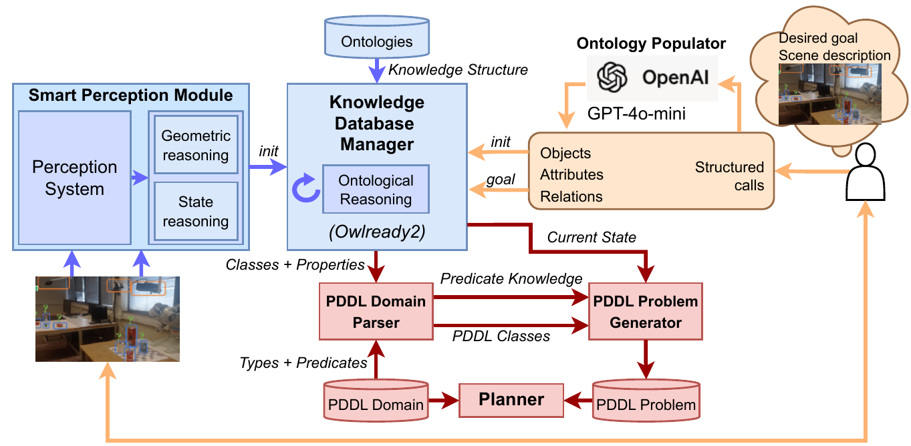

# Task and Situation Awareness using ontologies and LLMs 

This *metarepo* has been prepared to illustrate the work done in the [SMARTHANDLE](https://smarthandle-project.eu/) project within *Task 5.3: Learning based grasping – Planning for known & unfamiliar workpieces* regarding the use of ontologies and LLMs to make the robot aware of the situation and of the task, as part of deliverable *D5.2 SMARTHANDLE reasoning enablers*.

It contains two repositories:

- The [Ontology instantiation with LLMs](https://github.com/iocroblab/Ontology_population_paper) tool to allow the user to instantiate a situation ontology with information of the scene.
- The [Ontology PDDL Generation](https://github.com/iocroblab/ontology-pddl-generation) tool to automatically generate the PDDL problem file from the situation ontology.

The READMEs in each repository have the instructions to build and test the tools.

The figure below shows the schema of the system:

- A situation ontology has been defined in order to help the robot to understand the scene, i.e. to have ***situation awareness**. The ontology includes concepts for describing the relative location between objects, the ontology instances being provided by a smart perception module designed to perceive the environment (i.e., detect objects and their poses) and to perform geometric reasoning to determine the relative positions (blue blocks in the figure). 
- To address ambiguity and incompleteness in perception, however, the proposal also integrates LLMs to populate ontologies from natural language user inputs (orange blocks in the figure). The populated ontology is then processed using OWL-based reasoning tools, enabling robust world modelling.

- The LLM instantiation feature is also exploited to enable the user to define the goal state of a manipulation task. The approach assumes that the PDDL domain is fixed and given, and it uses this domain, together with the situation ontology, to generate the PDDL problem file. This is done by matching ontological concepts to PDDL types and predicates, resulting in a problem file that includes the PDDL objects, the initial state, and the goal state (red blocks in the figure). In this way, the robot is equipped with the **task awareness** necessary to solve the task using classical task planners. 

  
   
  <em>Figure 1. Obstacle avoidance example with an orientation constraint.</em>

A detailed description of this contribution is described in the paper [Robot Situation and Task Awareness using Large Language Models and Ontologies](docs/LLM_Onto_paper.pdf) by V. Molina, O. Ruiz-Celada, R. Suárez, J. Rosell and I. Zaplana, accepted to the 2025 Workshop on Safe and Sustainable AI-Aided Manufacturing (S2AIM).
